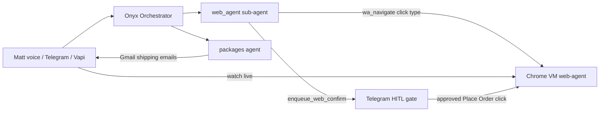

# Web-agent shopping — Zinc replacement

Mouse OS v2 will hand voice commands to **Onyx**, which already drives a
real Chrome VM (`web-agent`) on the VPS. This doc is the shopping playbook:
browser-native orders on Amazon, Newegg, and anywhere else — **no $50/mo Zinc API**.

## What you asked for

| You want | How it works today |
|----------|-------------------|
| "Order the LG 45 inch monitor on Newegg" | Onyx → `web_agent` → Newegg in logged-in Chrome |
| Conversational pick ("How about this one?" → "Yes") | `web_agent` presents 1–3 options, waits for yes, then carts |
| Watch the agent work | Portal `http://localhost:8080` (SSH tunnel from VPS) + noVNC |
| Amazon fan, orange, nice | Same flow on amazon.com with variant selection |
| Track the order | Gmail shipping email → `packages` agent (TBA/UPS/FedEx) |
| No APIs | Persistent Chromium profile; Matt's real sessions |

## Architecture



## Repo locations

All implementation lives in
`/home/indevilinspace/claude-recovery/wsl-the9nine/n8n-ultimate-assistant/`:

| Path | Purpose |
|------|---------|
| `web-agent/` | Docker Chrome VM, portal, noVNC, MP4 recordings |
| `web-agent/skills/web-agent-shopping/SKILL.md` | Shopping playbook (Amazon/Newegg) |
| `web-agent/commands/shop.md` | `/web-agent:shop` slash command |
| `agents/web_agent.json` | Onyx browser operator + checkout flows |
| `scripts/patch-web-agent-shopping.py` | Re-apply shopping patches after agent edits |

## Try it now

### 1. Watch the browser (from your machine)

**Tunnel is required** — Onyx can queue `web_agent_tunnel` via system_agent (Telegram approve),
or run manually:

```bash
bash ~/claude-recovery/wsl-the9nine/n8n-ultimate-assistant/scripts/web-agent-viewer-tunnel.sh
# or: ~/.assistant-bridge/web-agent-viewer-tunnel.sh
```

Then open:

| URL | What you see |
|-----|----------------|
| **http://127.0.0.1:8080/?token=YOUR_TOKEN** | Portal — live Chrome embedded (use the tunnel script to print the full URL) |

**Do not use localhost:6080** on the VPS setup — that port is not published. The live view is inside the portal page.

Run locally:

```bash
bash ~/.assistant-bridge/web-agent-viewer-tunnel.sh
```

It prints the exact URL to open (includes your token).
Firecrawl, or headless substitutes. It must quote `wa_read_page` / `wa_status` before
claiming a page loaded.

### 2. Talk to Onyx

Examples:

- *"Onyx, order the LG 45 inch monitor on Newegg"*
- *"Find me a really nice orange fan on Amazon — show me options"*
- *"Yes, buy that one"*
- *"Where's my Amazon package?"*

### 3. Approve on Telegram

When checkout is staged, Onyx sends a summary + total. Tap ✅ — the ACTION LANE
clicks Place Order in the real browser.

## Zinc is out

Zinc was the $50/month managed-order API. The stack now uses:

- **Browser** = real checkout on Matt's accounts (payment methods already saved)
- **HITL** = Telegram approval before any spend
- **Tracking** = Gmail + `packages` agent (not Zinc webhooks)

## Mouse OS v2 hook

Roadmap item `web-agent hand-off` (see
`docs/roadmap/2026-07-07-feature-roundtable.md`) wires voice utterances from
Mouse OS into Onyx. The shopping brain is already built; v1 Mouse OS is the
voice cursor, v2 is the bridge.

## Deploy workflow changes

After editing `agents/web_agent.json`:

```bash
cd ~/claude-recovery/wsl-the9nine/n8n-ultimate-assistant
python3 scripts/patch-web-agent-shopping.py
# then import build/Matts-Ultimate-Assistant.json into n8n
```
